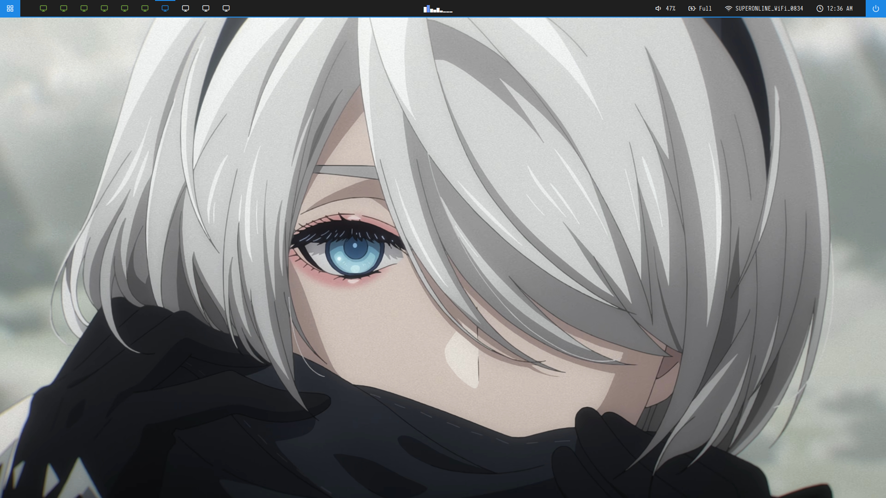
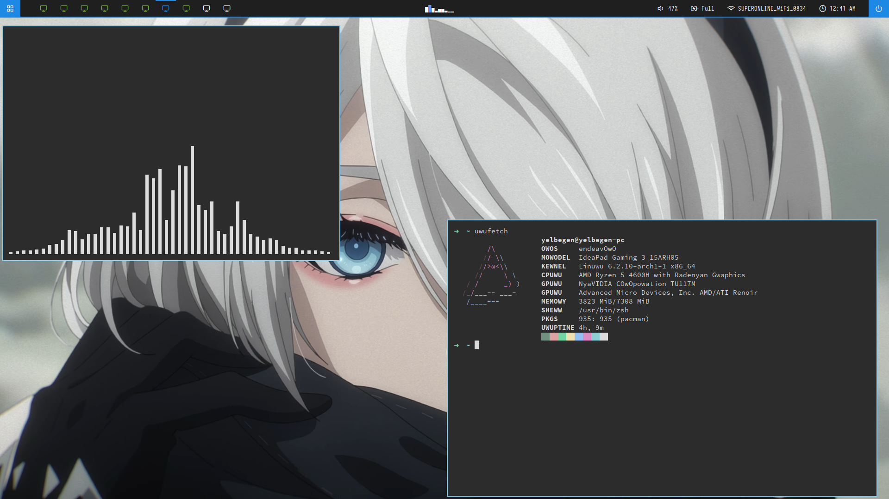

# dotfiles

bspwm dotfiles 

install this 

cava,flameshot,nvidia,nvidia-settings,nvidia-dkms,envycontrol,brave-beta-bin,materia-gtk-theme,papirus-icon-theme

use endavaour os bspwm cuz its good enough 

<h2>Screenshots</h2>

